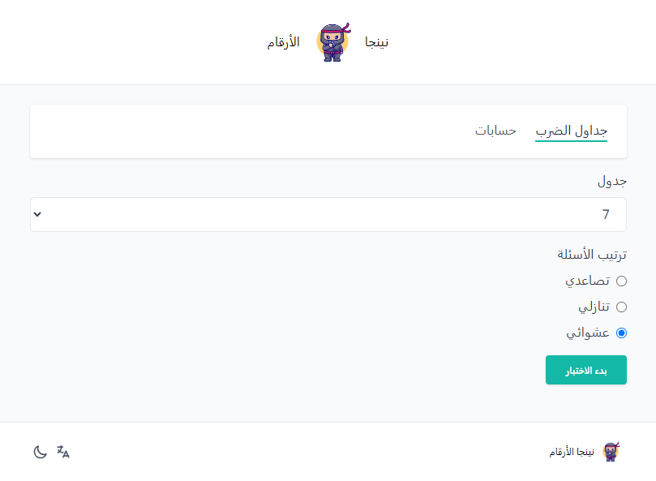

# Number Ninjas

An interactive math-solving web app designed for kids, making learning math a fun and exciting experience through engaging challenges.

## Features

- Multi-language support (Arabic and English)
- Dark theme
- Math quizzes
- Sound effects and visual feedback for each answer
- Special celebration for perfect score

## Getting Started

### 1. Clone the Repository

To get started, download or clone the app repository to your local machine using the following command:

```bash
git clone https://github.com/edriso/number-ninjas.git
```

### 2. Setup the Application

Navigate to the project directory and install the necessary dependencies by running:

```bash
npm install
```

### 3. Start the Application

Launch the application in development mode with the following command:

```bash
npm run dev
```

Now, _Number Ninjas_ is up and running on your local machine! Open your web browser and visit the specified localhost address to access the application.

## Snapshot



## Image Credits

- Ninja logo by [catalyststuff on Freepik](https://www.freepik.com/free-vector/cute-ninja-with-shuriken-cartoon-flat-cartoon-style_12873501.htm#query=cute%20ninja&position=4&from_view=keyword&track=ais&uuid=510e3e64-f47e-4ae9-bc7e-78982e2076ce)
- Error images by [unDraw](https://undraw.co/)
